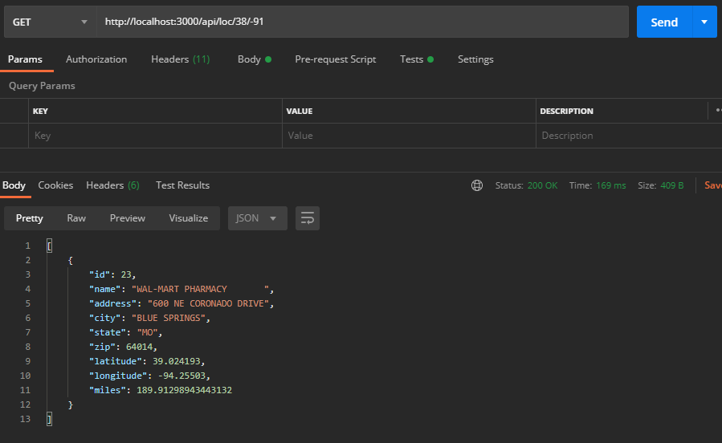

# Pharma-Find(API)

&nbsp;&nbsp;&nbsp;&nbsp;&nbsp;&nbsp;This repo contains a CSV to seed a MySQL database with. Feel free to seed your MySQL database with your own csv containing at least a latitude and longitude coloumn.

&nbsp;&nbsp;&nbsp;&nbsp;&nbsp;&nbsp;The repo will act as an API to return the closest in-network pharmacy based on input cordinates.


---

## Getting started

### Prerequisites

1. Git
1. Node
1. MySQL
1. A fork of this repo

### Setting up MySQL

1. Open your terminal and run the following commands
1. `sudo service mysql start`
1. Enter your administrative password<br/>
`* Starting MySQL database server mysqld`
1. sudo mysql<br/>
&nbsp;&nbsp;We do this to have maximum permission to freely set up mysql for the repo access<br/>
&nbsp;&nbsp;Save your decisions in a secure location because you will set up an .env file shortly
1. `CREATE DATABASE <databasename>;`
1. `USE <databasename>;`
1. `CREATE USER '<user>'@localhost IDENTIFIED BY '<userpassword>';`<br/>
&nbsp;&nbsp;More info and specifics on user creaion [here](https://dev.mysql.com/doc/refman/8.0/en/create-user.html).
1. `GRANT SELECT ON <databasename> TO '<user>'@localhost;`<br/>
&nbsp;&nbsp;More info and specifics on permssions [here](https://dev.mysql.com/doc/refman/8.0/en/grant.html).
1. `FLUSH PRIVILEGES;`<br/>
&nbsp;&nbsp;More info on FLUSHING [here](https://www.interserver.net/tips/kb/mysql-flush-commands/#:~:text=mysql%3E%20FLUSH%20PRIVILEGES%3B,reloading%20or%20restarting%20mysql%20service.).
1. CTRL + Z<br/>
&nbsp;&nbsp;You should be out of MySQL and back in your root folder in the CLI
1. `sudo service mysql restart`


### Initialization

1. In the CLI `git clone YOUR-GITHUB-FORK`
1. Navigate your CLI to the "RxSavings-circa-pharma" file
1. Run `npm install`
1. Observe the `.env` file that was created
1. Please include the following in the .env file based on the MySQL settings you chose.<br/>
&nbsp;&nbsp;&nbsp;&nbsp;&nbsp;&nbsp;Remove any carats `<` | `>` and insert your own settings. Local host can stay if you are running this on your own machine. Otherwise you'll need your instances's ip address.<br/>
```js
DB_HOST=<localhost>
DB_USER=< user name created in mysql >
DB_PASS=< the above user's password >
DB_DATABASE=< the database name >
PORT=< the port you want to use [DEFAULT IS 3000] >
```

---

### Demo
&nbsp;&nbsp;&nbsp;&nbsp;&nbsp;&nbsp;This API will allow `GET` requests to `http://localhost:3000/api/loc/${userLatitude}/${userLongitude}` and respond with the closest in-network pharmacy as an object within an array which will look like:

```js
[
    {
        "id": 23,
        "name": "WAL-MART PHARMACY       ",
        "address": "600 NE CORONADO DRIVE",
        "city": "BLUE SPRINGS",
        "state": "MO",
        "zip": 64014,
        "latitude": 39.024193,
        "longitude": -94.25503,
        "miles": 254.14420820385334
    }
]
```
<br/>
&nbsp;&nbsp;&nbsp;&nbsp;&nbsp;&nbsp;Postman GET request to latitude 38 longitude -91



---

### Dependencies
* axios
* dotenv
* express
* mysql
* promise-mysql

---

### Special Efforts

&nbsp;&nbsp;&nbsp;&nbsp;&nbsp;&nbsp;The biggest time sinks were devising how to parse out information from the Database in an efficient manner, setting up the `search` method in `functionality.js` because of the API call within the async chain, and utilizing the third party api MapBox. <br/>

&nbsp;&nbsp;&nbsp;&nbsp;&nbsp;&nbsp;Parsing information from the database the way I did prevents the database from sorting for the closest pharma and instead grabs a range that javascript could parse faster and with less load on a database that could serve other clients. <br/>

&nbsp;&nbsp;&nbsp;&nbsp;&nbsp;&nbsp;`search()` grew past the origonal functionality planned for it when an API call to MapBox was added. At the API call the object to be sent to the client was ready sans milage. The solution was to call a variable before the chain and assign it the pharmacy object, then alter with milage. <br/>

&nbsp;&nbsp;&nbsp;&nbsp;&nbsp;&nbsp;MapBox turned out to be the easier to use maping service alternative to Google Maps. Their API call seems non standared regaurding coordinates. Their API neccessitates longitude, latitude as aposed to atitude, longitude. Neither API was super user friendly, but time spent with MapBox was a better investment than with Google.

---

### Testing

&nbsp;&nbsp;&nbsp;&nbsp;&nbsp;&nbsp;Mocah and Chai are the testing libraries for this repo. They are devDependencies and wont be installed with the `npm install` command.<br/>

&nbsp;&nbsp;&nbsp;&nbsp;&nbsp;&nbsp;The API calls were not tested because this is a Tech assessment and the time spent organizing those test seemed less important than turning this assessment in ASAP. Setting up the Chai API testing library would be installed next. Then it would be implemented to test the API / `search()`. `search()` was tested while it was being built, but with it's call to Mapbox and primary function to serve the RxPharma API testing it with the current libraries is not possible.